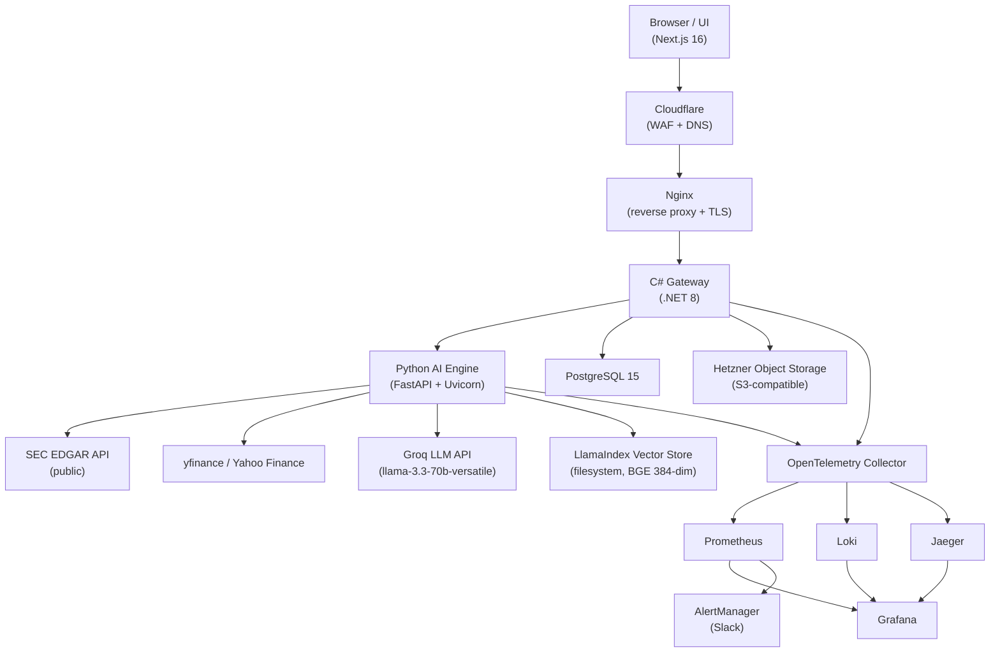
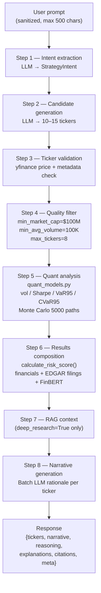

# Quant Platform

[Engelsk version](README.md)

En finansiell signalplattform i produktionsklass som genererar strukturerade bevakningslistor med kvantitativa riskmått, scenariesimuleringar och analys av SEC-dokumentation.

**Notera:** Detta repositorium är en strukturell snapshot för synlighet i jobbsökande sammanhang. Proprietära modeller, viktlogik och heuristik har ersatts med stubbar.

---

## Systemarkitektur

Plattformen separerar orkestrering från beräkningsintensiv analys:



---

## Engineering Highlights

- **Dual-service arkitektur** som separerar webborkestrering (.NET) från ML-belastningar (Python)
- **Statslös AI-motor** som är horisontellt skalbar bakom Nginx load balancing
- **End-to-end observability** med OpenTelemetry, Prometheus, Jaeger och Loki
- **Feltolerant LLM-pipeline** med fallback-leverantörer och deterministiska fallbacks
- **CI/CD-pipeline** med säkerhetsscanning (Trivy) och automatiserade releaser

---

## Kärnkomponenter

### Kvantitativ riskmotor
- Monte Carlo-simuleringar (5000 stigar, 30-dagars horisont)
- VaR- / CVaR-beräkningar
- Gaussisk HMM för detektering av marknadsregimer

### Watchlist Generation Pipeline



### RAG-analys av dokumentation
- SEC EDGAR-pipelinen för datainhämtning
- Hierarkisk chunking + auto-merging hämtning
- Grundad Q&A över finansiella dokument

### Gateway-tjänst (.NET 8)
- Hanterar auth, fakturering, rate limiting och orkestrering
- Asynkron hantering av förfrågningar för att förhindra lagg under ML-inferens

---

## Designval och avvägningar

- **Separering av tjänster:** isolerar ML-beroenden från webblagret på bekostnad av latens mellan tjänster
- **Synkron pipeline:** förenklar flödet men introducerar tråd-tryck vid hög latens

---

## Prestanda och skalbarhet

### Förfrågningsflöde

`klient → gateway (.NET) → AI engine (Python) → externa API:er (Groq LLM, SEC EDGAR, yfinance/news)`

Varje hop spåras med OpenTelemetry så att trace IDs kan följas end-to-end i Jaeger.

### Latens och observerbarhet

- End-to-end-latens spåras över gateway, AI engine och externa data-/LLM-anrop.
- En egen prestandaharness (`perf/run_perf.py`) stödjer baslinjer för `1`, `10` och `50` samtidiga användare och loggar `p50`, `p95`, genomströmning och felfrekvens per endpoint.
- Produktionslarm är satta till **gateway p95 > 1,5 s** och **AI engine p95 > 2,0 s**.
- De största latensdrivarna är **LLM-inferens** och **externa SEC-/marknads-/nyhetsanrop**.

### Skalningsstrategi

- **Horisontell skalning:** kör flera AI engine-replikor bakom gateway/load balancer.
- **Caching:** använd Redis + TTL-cachar för återkommande marknads-/nyhets-/analysanrop och förberäknade watchlist-artefakter.

---

## Arkitektonisk självkritik

- **Trådpool-mättnad:** långsamma LLM-anrop kan mätta gateway-trådar
  → V2: flytta till händelsestyrd arkitektur (Kafka / RabbitMQ)

- **Sårbar datainhämtning:** hårt kopplad till externa finansiella API:er
  → V2: inför schemavalidering och ett extra lager för inhämtning

---

## Köra lokalt

```bash
cd infra && docker compose up -d
```

| Tjänst | URL |
|---|---|
| Gateway | http://localhost:8000 |
| AI Engine | http://localhost:5000 |
| UI | http://localhost:3000 |

---

## Repositorystruktur

- `/services/gateway`: .NET 8 API (auth, fakturering, orkestrering)
- `/services/ai-engine`: Python-tjänst (kvantitativa modeller, RAG)
- `/ui`: Next.js-frontend
- `/infra`: Docker Compose + Nginx
