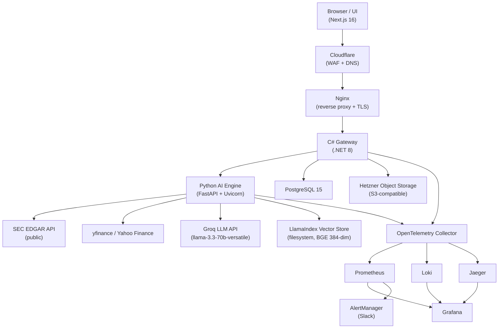
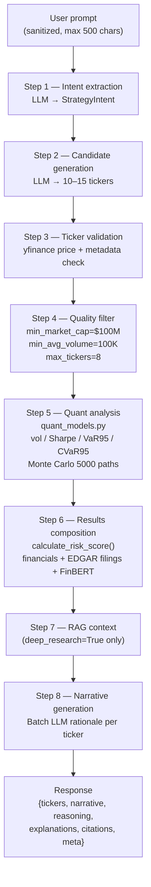

# Quant Platform

[Svensk version](README-sv.md)

A system that generates structured watchlists with quantitative risk metrics, scenario simulations, and SEC filing analysis.

**Note:** This repository is a structural snapshot for hiring visibility. Proprietary models, weighting logic, and heuristics are replaced with stubs.

---

## System Architecture

The platform separates orchestration from compute-heavy analytics:



---

## Engineering Highlights

- **Dual-service architecture** separating web orchestration (.NET) from ML workloads (Python)
- **Stateless AI engine** horizontally scalable behind Nginx load balancing
- **End-to-end observability** using OpenTelemetry, Prometheus, Jaeger, and Loki
- **Fault-tolerant LLM pipeline** with provider fallback and deterministic fallbacks
- **CI/CD pipeline** with security scanning (Trivy) and automated deployments

---

## Core Components

### Quantitative Risk Engine
- Monte Carlo simulations (5000 paths, 30-day horizon)
- VaR / CVaR calculations
- Gaussian HMM for market regime detection

### Watchlist Generation Pipeline



### RAG Filing Analysis
- SEC EDGAR ingestion pipeline
- Hierarchical chunking + auto-merging retrieval
- Grounded Q&A over financial documents

### Gateway Service (.NET 8)
- Handles auth, billing, rate limiting, and orchestration
- Async request handling to prevent blocking during ML inference

---

## Design Trade-offs

- **Service separation:** isolates ML dependencies from the web layer at the cost of inter-service latency  
- **Synchronous pipeline:** simplifies flow but introduces thread pressure under high latency  

---

## Performance & Scalability

### Request flow

`client → gateway (.NET) → AI engine (Python) → external APIs (Groq LLM, SEC EDGAR, yfinance/news)`

Each hop emits OpenTelemetry spans so trace IDs can be followed end-to-end across services in Jaeger.

### Latency & Observability

- End-to-end latency is traced with OpenTelemetry across the gateway, AI engine, and external data/LLM calls.
- A custom perf harness (`perf/run_perf.py`) supports `1`, `10`, and `50` concurrent-user baselines and records `p50`, `p95`, throughput, and failure rate per endpoint.
- Production alert thresholds are set at **gateway p95 > 1.5s** and **AI engine p95 > 2.0s**.
- The main latency drivers are **LLM inference** and **external SEC / market / news fetches**.

### Scaling strategy

- **Horizontal scaling:** run multiple AI engine replicas behind the gateway/load balancer.
- **Caching:** use Redis + TTL caches for repeated market/news/analysis fetches and precomputed watchlist artifacts.

---

## Architectural Self-Critique

- **Thread pool pressure:** long-running LLM calls can saturate gateway threads  
  → V2: move to event-driven architecture (Kafka / RabbitMQ)

- **Data ingestion fragility:** tightly coupled to external financial APIs  
  → V2: introduce schema validation and ingestion layer

---

## Running Locally

```bash
cd infra && docker compose up -d
```

| Service | URL |
|---|---|
| Gateway | http://localhost:8000 |
| AI Engine | http://localhost:5000 |
| UI | http://localhost:3000 |

---

## Repository Structure

- `/services/gateway`: .NET 8 API (auth, billing, orchestration)
- `/services/ai-engine`: Python service (quant models, RAG)
- `/ui`: Next.js frontend
- `/infra`: Docker Compose + Nginx
